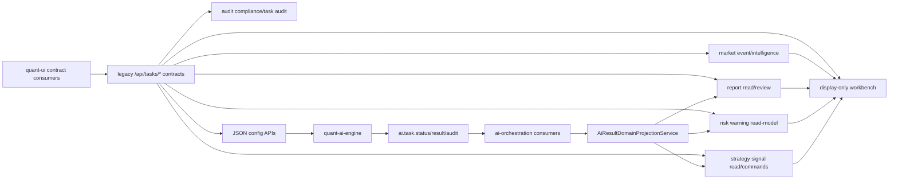

# Transition Host Exit Criteria Inventory

## Status And Scope

Status: Phase 008 durable inventory.

Scope: docs-only architecture and governance inventory for the current `ai-orchestration-service` transition host.

This document records current responsibilities, dependencies, exit criteria and readiness gates. It does not implement service extraction, route migration, gateway/auth, config-store migration, data-ingest split, permanent modular monolith status, database schema change, Kafka change, frontend change, Python change, business code change or any new feature.

Phase 005 remains the current governance-horizon policy: continue as a modular monolith inside `ai-orchestration-service` while preserving that host as transitional, not final architecture. Phase 006 remains the frozen legacy non-task `/api/tasks/*` contract inventory. Phase 007 remains the current frontend authority guard for workbench and fallback provenance consumers.

## Inputs And Read-Only Inspection Sources

Harness inputs:

- `docs/harness/00-project-charter.md`
- `docs/harness/02-authority-matrix.md`
- `docs/harness/03-host-ownership.md`
- `docs/harness/04-contract-map.md`
- `docs/harness/05-transition-lifetime.md`
- `docs/harness/08-eval-checklist.md`
- `docs/harness/09-window-protocol.md`
- `docs/harness/state/current-state.md`
- `docs/harness/handoffs/steering-decision-phase-008.md`
- `docs/harness/handoffs/phase-008-architect.md`

Read-only inventory commands used:

- `rg -n "@RequestMapping|@GetMapping|@PostMapping|@PutMapping|@DeleteMapping|requirePermission" quant-ai-platform/quant-services/quant-business/ai-orchestration-service/src/main/java/com/quant/aiorchestrator/controller`
- `rg -n "KafkaListener|ai\\.task|market\\.event|risk\\.warning|strategy\\.signal|report\\.generated|notification\\.dispatch" quant-ai-platform/quant-services/quant-business/ai-orchestration-service/src/main/java/com/quant/aiorchestrator quant-ai-platform/quant-ai-engine/app`
- `rg -n "class .*DO|@TableName|interface .*Mapper" quant-ai-platform/quant-services/quant-business/ai-orchestration-service/src/main/java/com/quant/aiorchestrator`
- `rg -n "export interface|export function|/api/tasks|/api/research/tasks" quant-ui/src/api/task.ts quant-ui/src/types/task.ts`
- `rg --files quant-ai-platform/ai-config`
- `rg --files` over the in-scope Java controller/service/consumer trees, frontend view/component/utility trees and Python engine `app` tree.

The inspection found only current transition-host facts. No code, test, frontend, Python, config, build or deployment file was changed for Phase 008.

## Domain Inventory Summary

| Domain | Belongs | SoT / authority | Current host class | Read-model surfaces | Command surface | Legacy route dependency | Exit direction |
| --- | --- | --- | --- | --- | --- | --- | --- |
| report | Report facts and review workflow in `ai-orchestration-service` | `research_report`, `research_report_version`, `research_report_section`, `report_evidence_ref` | transition host | task report, report versions, report center, review logs, review stats | report review | `/api/tasks/{taskId}/report*`, `/api/tasks/report-*` | define report ownership, evidence ownership, review command authority and route plan before any move |
| market | Market event and market intelligence surfaces in `ai-orchestration-service` | `market_event`, `market_event_relation`, `market_event_analysis`; event source config files for current config facts | transition host | market events, stats, ingest history, source configs, market intelligence | create, batch import, mock ingest, source sync, preview, diagnose | `/api/tasks/market-*` | separate real ingest, mock/demo ingest, CNINFO proxy, route and SoT decisions before any move |
| risk | Risk warning query and AI projection output in `ai-orchestration-service` | `risk_warning`, `risk_warning_detail` | transition host | risk warnings, risk stats | none in current REST surface | `/api/tasks/risk-*` | define projection boundary and downstream event use before extraction |
| strategy | Strategy signal query and command surfaces in `ai-orchestration-service` | `strategy_signal`, `strategy_signal_factor` | transition host | strategy signals, stats, factors | create signal, update signal status | `/api/tasks/strategy-*` | define signal command owner and projection boundary before extraction |
| audit | Audit, message log and config audit surfaces in `ai-orchestration-service` | `audit_record`, `task_message_log`, `ai_prompt_audit`, config change audit files | formal for current audit facts plus transition dashboard | task audits, audit compliance, audit stats, config audit display | config mutations produce audit records/files; no standalone audit command surface | `/api/tasks/{taskId}/audits`, `/api/tasks/audit-*` | define cross-domain audit ownership, retention and auth model before extraction |
| config | JSON runtime configuration APIs in `ai-orchestration-service` | `ai-config/*.json`, role config plus current request headers | transition host | model-agent config center, role access configs | prompt, model strategy, event trigger, event source, agent, workflow and role config updates | `/api/tasks/model-agent-config*`, `/api/tasks/role-access-configs` | choose config store, versioning and Java/Python reader contract before migration |
| workbench | Display-only aggregation in `ai-orchestration-service` | none | transition aggregation host | research workbench | none | `/api/tasks/research-workbench` | keep display-only; define consumer and aggregation replacement gates before any route or host change |

## Report Domain

### Belongs Analysis

Report query, report center, report review, report versions and report evidence surfaces currently belong to `ai-orchestration-service` as a transition host. `AiResultDomainProjectionService` writes report and evidence projections from AI results, but Phase 008 does not redesign or move that projection path.

### Authority Objects

- `research_report`
- `research_report_version`
- `research_report_section`
- `report_evidence_ref`
- Review-related transition data in `research_report_review_log` and `human_review_record`

Report fallback provenance and `reportMeta.contextSnapshot` data are metadata only. They are not SoT and must not be promoted to report truth.

### Current Host Classification

`ai-orchestration-service` is the current transition host for report facts, read models and review command handling. It is not declared final report architecture.

### Read-Model Surfaces

- `GET /api/tasks/{taskId}/report`
- `GET /api/tasks/{taskId}/report/versions`
- `GET /api/tasks/{taskId}/report/versions/compare`
- `GET /api/tasks/{taskId}/report/versions/{versionNo}`
- `GET /api/tasks/{taskId}/report/review-logs`
- `GET /api/tasks/report-center`
- `GET /api/tasks/report-center-stats`
- `GET /api/tasks/report-review-stats`

### Command Surface

- `POST /api/tasks/{taskId}/report/review`

The review command remains a transition-host command. Phase 008 does not change permission behavior or command ownership.

### Aggregation And Display Surfaces

- Report center list and stats are read-model/display surfaces.
- Task report pages and report version panels display report facts and evidence.
- Rejected, pending and approved report workbenches are frontend filters over existing report/review contracts, not separate authority.

### Legacy Route Dependencies

All report routes above remain under the frozen legacy `/api/tasks/*` namespace. Phase 006 keeps these paths stable as transitional contracts; Phase 008 does not approve route migration or aliases.

### Storage, Config And Kafka

- Tables/entities: `research_report`, `research_report_version`, `research_report_section`, `report_evidence_ref`, `research_report_review_log`, `human_review_record`.
- Kafka dependency: `ai.task.result` feeds Java projection; downstream `report.generated` remains listed as placeholder/downstream topic in the contract map, not as a new Phase 008 behavior.
- Config dependency: report generation may reference model, workflow, prompt and agent JSON config, but config ownership remains the config domain.

### Main Java Files

- `ReportController.java`
- `ReportQueryService.java`
- `ReportQueryServiceImpl.java`
- `ReportVersionService.java`
- `ReportVersionServiceImpl.java`
- `TaskReportService.java`
- `TaskReportServiceImpl.java`
- `AiResultDomainProjectionService.java`
- `AiResultDomainProjectionServiceImpl.java`
- `ResearchReportMapper.java`
- `ResearchReportVersionMapper.java`
- `ResearchReportSectionMapper.java`
- `ReportEvidenceRefMapper.java`
- `ResearchReportReviewLogMapper.java`
- `HumanReviewRecordMapper.java`

### Frontend Consumers

- API functions in `quant-ui/src/api/task.ts`: `fetchTaskReport`, `reviewTaskReport`, `fetchReportCenter`, `fetchReportCenterStats`, `fetchReportReviewStats`, `fetchTaskReportReviewLogs`, `fetchTaskReportVersions`, `fetchTaskReportVersion`, `compareTaskReportVersions`.
- Types in `quant-ui/src/types/task.ts`: `TaskReport`, `TaskReportMeta`, `TaskReportContextSnapshot`, `TaskReportEvidenceItem`, `TaskReportSection`, `ReportVersion`, `ReportVersionCompare`, `ReportCenterListItem`, `ReportCenterPageData`, `ReportReviewStats`, `TaskReportReviewLog`.
- Views/components: `TaskReportView.vue`, `ResearchReportCenterView.vue`, `PendingReportWorkbenchView.vue`, `ApprovedReportWorkbenchView.vue`, `RejectedReportWorkbenchView.vue`, `TaskReportCard.vue`, `ReportEvidenceView.vue`, `ReportVersionHistoryPanel.vue`, `ReportVersionComparison.vue`.

### Python Touchpoints

- `report_generation_agent.py`
- `langchain_report_service.py`
- `market_data_service.py` as context/fallback input only
- Kafka producer/result emission through the engine messaging layer

Python-generated report content and fallback provenance remain execution output and metadata. Java projection remains the transition host for persisted report read models.

### Current Guardrails

- Phase 004: fallback provenance stays visible as metadata and must not become model-generated truth.
- Phase 006: legacy `/api/tasks/*` report routes are frozen.
- Phase 007: frontend report metadata and fallback fields are display/audit metadata only.
- Phase 005: modular monolith continues only for the current governance horizon.

### Extraction Blockers

- Report read models, review command, evidence projection and frontend consumers still share legacy `/api/tasks/*` routes.
- AI result projection currently writes report/evidence together with risk and strategy projections.
- Report review uses current role-access header/config permissions.
- Report metadata contains fallback provenance that must remain non-authoritative across any future move.

### Exit Criteria

- A later report phase inventories report-only commands, read models, evidence refs, review logs and frontend consumers in more detail.
- Report command owner, report read-model owner and evidence owner are explicitly decided by Window 0 plus human approval.
- Route migration, if ever proposed, includes compatibility, breaking-change approval and Phase 006 inventory update.
- Projection ownership is separated or explicitly retained with a documented contract.
- Frontend report consumers are mapped to the future contract without deriving authority from display fields.

### Readiness Gate

Before any report extraction, route migration or permanence decision:

- belongs gate: report facts and review commands have one approved host.
- authority gate: report evidence and fallback provenance are not alternate SoT.
- contract gate: current URLs, methods and response shapes have an approved migration or compatibility plan.
- behavior gate: review, versioning, evidence display and audit behavior have focused verification.

## Market Domain

### Belongs Analysis

Market event query, create/import, mock ingest, source sync/preview/diagnose, CNINFO proxy, ingest history and market intelligence read surfaces currently live in `ai-orchestration-service` as transition responsibilities. Phase 008 records those responsibilities but does not select a real data-ingest service.

### Authority Objects

- `market_event`
- `market_event_relation`
- `market_event_analysis`
- `event-source-configs.json` for current event source config facts
- `event-ingest-histories.json` for current ingest history config/file facts

Market intelligence is display/read-model output and must not replace `market_event` authority.

### Current Host Classification

`ai-orchestration-service` is the transition host for market event facts, demo/mock ingest, source sync adapters and market intelligence display. This is not final data-ingest architecture.

### Read-Model Surfaces

- `GET /api/tasks/market-events`
- `GET /api/tasks/market-event-stats`
- `GET /api/tasks/market-events/{eventId}`
- `GET /api/tasks/market-events/ingest-history`
- `GET /api/tasks/market-event-source-configs`
- `GET /api/tasks/market-events/cninfo-proxy`
- `GET /api/tasks/market-intelligence`
- `GET /api/tasks/market-intelligence-stats`

### Command Surface

- `POST /api/tasks/market-events`
- `POST /api/tasks/market-events/batch-import/preview`
- `POST /api/tasks/market-events/batch-import`
- `POST /api/tasks/market-events/mock-ingest`
- `POST /api/tasks/market-events/source-sync/{sourceCode}`
- `POST /api/tasks/market-events/source-preview/{sourceCode}`
- `POST /api/tasks/market-events/source-diagnose/{sourceCode}`

Mock ingest and preview/diagnose remain demo/transition behavior.

### Aggregation And Display Surfaces

- `market-intelligence` is display/read-model aggregation.
- Market event center and intelligence center frontend views display market event facts and derived analysis, not independent truth.

### Legacy Route Dependencies

All market routes above use the frozen legacy `/api/tasks/*` namespace. Phase 008 does not add aliases, move paths or approve route migration.

### Storage, Config And Kafka

- Tables/entities: `market_event`, `market_event_relation`, `market_event_analysis`.
- Config files: `event-source-configs.json`, `event-ingest-histories.json`, `event-auto-trigger-configs.json`.
- Kafka: `market.event.standardized` is consumed by `MarketEventStandardizedConsumer`; downstream event constants for risk/strategy/report/notification are not implemented as Phase 008 behavior.

### Main Java Files

- `MarketEventController.java`
- `MarketIntelligenceController.java`
- `MarketEventService.java`
- `MarketEventServiceImpl.java`
- `MarketQueryService.java`
- `MarketQueryServiceImpl.java`
- `MarketEventIngestHistoryService.java`
- `MarketEventIngestHistoryServiceImpl.java`
- `MarketEventAutoTriggerService.java`
- `MarketEventAutoTriggerServiceImpl.java`
- `EventSourceConfigService.java`
- `EventSourceConfigServiceImpl.java`
- `EventSourcePreviewService.java`
- `EventSourcePreviewServiceImpl.java`
- Existing sync adapters: `EventSourceSyncAdapter.java`, `MockEventSourceSyncAdapter.java`, `HttpJsonEventSourceSyncAdapter.java`, `RssXmlEventSourceSyncAdapter.java`, `CninfoProxyEventSourceSyncAdapter.java`, `CninfoPublicAnnouncementSyncAdapter.java`, `CsrcRiskHtmlSyncAdapter.java`, `GovCnPolicyHtmlSyncAdapter.java`
- `CninfoProxyAnnouncementService.java`
- `CninfoProxyAnnouncementServiceImpl.java`
- `MarketEventStandardizedPublisherService.java`
- `MarketEventStandardizedConsumer.java`
- `MarketEventMapper.java`
- `MarketEventRelationMapper.java`
- `MarketEventAnalysisMapper.java`

### Frontend Consumers

- API functions in `quant-ui/src/api/task.ts`: `fetchMarketEvents`, `fetchMarketEvent`, `fetchMarketEventStats`, `fetchMarketEventIngestHistory`, `fetchMarketEventSourceConfigs`, `createMarketEvent`, `previewBatchImportMarketEvents`, `batchImportMarketEvents`, `mockIngestMarketEvents`, `syncMarketEventSource`, `previewMarketEventSource`, `diagnoseMarketEventSource`, `fetchMarketIntelligence`, `fetchMarketIntelligenceStats`.
- Types in `quant-ui/src/types/task.ts`: `MarketEventListItem`, `MarketEventPageData`, `MarketEventStats`, `MarketEventRelation`, `MarketEventCreateForm`, `MarketEventBatchImportForm`, `MarketEventMockIngestForm`, `EventSourceConfigItem`, `EventSourcePreviewResult`, `EventSourceRequestDiagnosticResult`, `MarketIntelligenceListItem`, `MarketIntelligencePageData`.
- Views/components: `MarketEventCenterView.vue`, `MarketIntelligenceCenterView.vue`, `MarketIntelligenceStatsCards.vue`.

### Python Touchpoints

- `market_data_service.py` builds backend-overlaid and fallback market context.
- Planner, financial, risk and report agents may consume market context during AI execution.

Python market fallback snapshots must remain labeled/provenance-bearing and must not become market data SoT.

### Current Guardrails

- Phase 004: Python market fallback provenance must stay auditable.
- Phase 006: market legacy `/api/tasks/*` routes are frozen.
- Phase 007: frontend fallback provenance remains display/audit metadata.
- T3 in transition lifetime: mock ingest is demo/test only and not production data source.

### Extraction Blockers

- Mock ingest, source sync adapters, CNINFO proxy and market event persistence are in the same transition host.
- Event source config and ingest history are JSON/file-backed, not a stable target store.
- Market intelligence display depends on current market event read models and frontend API names.
- Real data-ingest ownership is undecided.

### Exit Criteria

- Real source sync, mock ingest, preview/diagnose and CNINFO proxy responsibilities are classified separately.
- Data-ingest owner is approved or current transition hosting is explicitly retained for another bounded horizon.
- Market event SoT, market intelligence display and Python fallback context are separated in docs and tests.
- Legacy route dependency and compatibility/breaking-change plan are approved before any route move.

### Readiness Gate

Before any market extraction, route migration or data-ingest split:

- belongs gate: event facts, source config and ingest jobs have approved hosts.
- authority gate: mock/demo data and Python fallback context remain non-production/non-authoritative.
- contract gate: frontend API functions and `/api/tasks/market-*` contracts are inventoried and guarded.
- behavior gate: create/import/sync/preview/diagnose flows have a verification plan.

## Risk Domain

### Belongs Analysis

Risk warning query and stats currently belong to `ai-orchestration-service` as transition read-model responsibilities. Risk warning facts are produced from AI result projection; Phase 008 does not change the projection service.

### Authority Objects

- `risk_warning`
- `risk_warning_detail`

Risk points embedded in reports or frontend summaries are display material unless projected into the risk warning authority objects.

### Current Host Classification

`ai-orchestration-service` is the transition host for current risk warning facts and read models.

### Read-Model Surfaces

- `GET /api/tasks/risk-warnings`
- `GET /api/tasks/risk-warning-stats`

### Command Surface

No standalone risk command surface is present in the inspected controller routes. Risk warnings are fed by AI result projection and read through the transition host.

### Aggregation And Display Surfaces

- Risk warning center and stats cards are display/read-model consumers.
- Workbench and report summaries may display risk points, but they must not become risk authority.

### Legacy Route Dependencies

Risk warning surfaces are frozen legacy `/api/tasks/*` routes.

### Storage, Config And Kafka

- Tables/entities: `risk_warning`, `risk_warning_detail`.
- Kafka dependency: `ai.task.result` feeds `AiResultDomainProjectionService`; downstream `risk.warning.generated` remains a listed downstream topic, not a Phase 008 behavior change.

### Main Java Files

- `RiskWarningController.java`
- `RiskQueryService.java`
- `RiskQueryServiceImpl.java`
- `AiResultDomainProjectionService.java`
- `AiResultDomainProjectionServiceImpl.java`
- `RiskWarningMapper.java`
- `RiskWarningDetailMapper.java`

### Frontend Consumers

- API functions in `quant-ui/src/api/task.ts`: `fetchRiskWarnings`, `fetchRiskWarningStats`.
- Types in `quant-ui/src/types/task.ts`: `RiskWarningListItem`, `RiskWarningPageData`, `RiskWarningStats`.
- Views/components: `RiskWarningCenterView.vue`, `RiskWarningStatsCards.vue`, workbench risk summaries.

### Python Touchpoints

- `risk_review_agent.py`
- `langchain_risk_service.py`
- fallback provenance created during AI execution when model calls fail or are disabled.

### Current Guardrails

- Phase 004: risk fallback provenance is metadata and audit signal only.
- Phase 006: legacy risk routes are frozen.
- Phase 007: frontend provenance fields must not drive command authority.

### Extraction Blockers

- Risk facts are projected together with report and strategy facts by a shared projection service.
- Risk query is read-only at REST, so command ownership depends on projection ownership and AI result contracts.
- Workbench/report display can make risk look embedded in other surfaces unless guardrails remain explicit.

### Exit Criteria

- Projection boundary for risk is decided before any host move.
- Downstream event usage for `risk.warning.generated`, if introduced later, is approved in a separate phase.
- Workbench/report risk display remains non-authoritative or is replaced by explicit risk read-model calls.

### Readiness Gate

Before any risk extraction:

- belongs gate: risk projection writer and risk query owner are identified.
- authority gate: report/workbench risk summaries are not used as risk SoT.
- contract gate: existing `/api/tasks/risk-*` contracts have migration and compatibility decisions.
- behavior gate: projection and query regression coverage is planned.

## Strategy Domain

### Belongs Analysis

Strategy signal query, factor query, create command and status command currently live in `ai-orchestration-service` as transition responsibilities. AI result projection may also produce strategy signal facts.

### Authority Objects

- `strategy_signal`
- `strategy_signal_factor`

Report confidence fields or frontend strategy summaries are display context unless persisted to these authority objects.

### Current Host Classification

`ai-orchestration-service` is the transition host for strategy facts, read models and current strategy commands.

### Read-Model Surfaces

- `GET /api/tasks/strategy-signals`
- `GET /api/tasks/strategy-signal-stats`
- `GET /api/tasks/strategy-signals/{signalId}/factors`

### Command Surface

- `POST /api/tasks/strategy-signals`
- `POST /api/tasks/strategy-signals/{signalId}/status`

These commands remain under current role-access behavior and are not moved by Phase 008.

### Aggregation And Display Surfaces

- Strategy signal center and stats cards display strategy read models.
- Workbench/report strategy highlights are display aggregation, not strategy SoT.

### Legacy Route Dependencies

All strategy routes remain frozen legacy `/api/tasks/*` routes.

### Storage, Config And Kafka

- Tables/entities: `strategy_signal`, `strategy_signal_factor`.
- Kafka dependency: `ai.task.result` can feed projection. Downstream `strategy.signal.generated` remains listed in the contract map, not implemented by Phase 008.

### Main Java Files

- `StrategySignalController.java`
- `StrategyQueryService.java`
- `StrategyQueryServiceImpl.java`
- `StrategySignalService.java`
- `StrategySignalServiceImpl.java`
- `AiResultDomainProjectionService.java`
- `AiResultDomainProjectionServiceImpl.java`
- `StrategySignalMapper.java`
- `StrategySignalFactorMapper.java`

### Frontend Consumers

- API functions in `quant-ui/src/api/task.ts`: `fetchStrategySignals`, `fetchStrategySignalStats`, `createStrategySignal`, `fetchStrategySignalFactors`, `updateStrategySignalStatus`.
- Types in `quant-ui/src/types/task.ts`: `StrategySignalListItem`, `StrategySignalPageData`, `StrategySignalStats`, `StrategySignalFactorItem`, `StrategySignalCreateForm`, `StrategySignalCreateFactorForm`.
- Views/components: `StrategySignalCenterView.vue`, `StrategySignalStatsCards.vue`.

### Python Touchpoints

No dedicated Python strategy command path was identified by file name. AI result payloads and report/analysis agents may provide strategy context consumed by Java projection. That context is not a direct Python-owned strategy SoT.

### Current Guardrails

- Phase 006: strategy routes are frozen.
- Phase 007: frontend cannot promote workbench/report strategy display to authority.
- Phase 005: current host remains transitional.

### Extraction Blockers

- REST commands and read models live under legacy `/api/tasks/*`.
- Strategy signal commands currently share role permission patterns with report review.
- Projection and manual command responsibilities need an explicit owner split before extraction.

### Exit Criteria

- Strategy command owner and projection writer owner are explicitly decided.
- Strategy read models and factor queries have a stable target contract.
- Permission semantics are documented before any route or host move.
- Workbench/report strategy displays remain display only.

### Readiness Gate

Before any strategy extraction:

- belongs gate: manual strategy command and AI projection paths have one approved target.
- authority gate: frontend/workbench strategy summaries are not used as SoT.
- contract gate: all `/api/tasks/strategy-*` routes are covered by migration or retention decisions.
- behavior gate: create/status/factor query behavior has focused verification.

## Audit Domain

### Belongs Analysis

Audit records, task message logs, AI prompt audits, task audit read models and audit compliance dashboard currently live in `ai-orchestration-service`. Config change audit files are part of the current JSON config transition path.

### Authority Objects

- `audit_record`
- `task_message_log`
- `ai_prompt_audit`
- `config-change-audits.json`

Audit display pages are read models. They do not create business facts.

### Current Host Classification

`ai-orchestration-service` is the current host for audit persistence and read models. Some audit dashboard surfaces are transition aggregation/read-model APIs.

### Read-Model Surfaces

- `GET /api/tasks/{taskId}/audits`
- `GET /api/tasks/audit-compliance`
- `GET /api/tasks/audit-compliance-stats`
- Config dashboard surfaces that include config change audit entries.

### Command Surface

No standalone audit command surface is exposed in the inspected controller routes. Audit facts are generated by task/Kafka processing, config mutation paths and AI audit consumption.

### Aggregation And Display Surfaces

- Audit compliance dashboard and stats are read-model/display surfaces.
- Task detail audit tables display task-scoped audit facts.
- Config center displays config change audit entries.

### Legacy Route Dependencies

Audit surfaces remain under `/api/tasks/*` and are protected by Phase 006 route freeze.

### Storage, Config And Kafka

- Tables/entities: `audit_record`, `task_message_log`, `ai_prompt_audit`.
- Config file: `config-change-audits.json`.
- Kafka: `ai.task.audit` is consumed by `AiTaskAuditConsumer`; status/result consumers and inbound message support also write message/audit traces.

### Main Java Files

- `AuditComplianceController.java`
- `TaskQueryController.java` for task-scoped audit reads
- `AuditComplianceQueryService.java`
- `AuditComplianceQueryServiceImpl.java`
- `AuditConfigDashboardQueryService.java`
- `AuditConfigDashboardQueryServiceImpl.java`
- `TaskMessageLogService.java`
- `TaskMessageLogServiceImpl.java`
- `ConfigChangeAuditService.java`
- `ConfigChangeAuditServiceImpl.java`
- `AiTaskAuditConsumer.java`
- `AiTaskInboundMessageSupportService.java`
- `AiTaskInboundMessageSupportServiceImpl.java`
- `AuditRecordMapper.java`
- `TaskMessageLogMapper.java`
- `AiPromptAuditMapper.java`

### Frontend Consumers

- API functions in `quant-ui/src/api/task.ts`: `fetchAuditCompliance`, `fetchAuditComplianceStats`, task detail/full-detail functions that include audits.
- Types in `quant-ui/src/types/task.ts`: `AuditRecord`, `AuditComplianceListItem`, `AuditCompliancePageData`, `AuditComplianceStats`, `ConfigChangeAuditItem`.
- Views/components: `AuditComplianceCenterView.vue`, `AuditComplianceStatsCards.vue`, `TaskAuditsTable.vue`, `ModelAgentConfigCenterView.vue`.

### Python Touchpoints

- Kafka producer/audit message path in `app/messaging`.
- Agent execution services and graph nodes can emit audit events through the AI engine messaging contract.

### Current Guardrails

- Phase 006: audit legacy routes are frozen.
- Phase 004: Python fallback/audit metadata stays visible and non-authoritative.
- T6: header-based demo auth is not production security.

### Extraction Blockers

- Audit facts cross task runtime, AI execution, config mutation and prompt audit boundaries.
- Audit display depends on current header-based role access.
- Config audit files are tied to JSON config storage, which has not been replaced.

### Exit Criteria

- Audit ownership, retention, permission source and cross-domain event ingestion boundaries are decided.
- Config audit storage target is decided before config-store migration.
- Task-scoped audit reads and compliance dashboard reads have stable target contracts.

### Readiness Gate

Before any audit extraction:

- belongs gate: audit event writer, storage and read model have approved host(s).
- authority gate: audit dashboards are not command sources.
- contract gate: task audit and audit compliance routes are inventoried and guarded.
- behavior gate: AI audit, config audit and task message idempotency behavior have verification.

## Config Domain

### Belongs Analysis

Model, agent, workflow, prompt template, model strategy, event source, event auto trigger and role access config APIs currently live in `ai-orchestration-service` as transition config responsibilities backed by JSON files. Java and Python both read these config files.

### Authority Objects

- `agent-configs.json`
- `workflow-configs.json`
- `model-strategies.json`
- `event-source-configs.json`
- `event-auto-trigger-configs.json`
- `role-access-configs.json`
- `config-change-audits.json`
- `event-ingest-histories.json`

Request headers remain part of the current demo/runtime permission facts together with role access config. Frontend local role selection is not permission SoT.

### Current Host Classification

`ai-orchestration-service` is the transition host for config dashboard/read/update APIs. JSON files remain the current config store by policy, not a final architecture decision.

### Read-Model Surfaces

- `GET /api/tasks/model-agent-config`
- `GET /api/tasks/role-access-configs`

### Command Surface

- `POST /api/tasks/model-agent-config/prompt-templates/{templateCode}`
- `POST /api/tasks/model-agent-config/model-strategies/{strategyCode}`
- `POST /api/tasks/model-agent-config/event-auto-trigger-rules/{ruleCode}`
- `POST /api/tasks/model-agent-config/event-sources/{sourceCode}`
- `POST /api/tasks/model-agent-config/agents/{agentCode}`
- `POST /api/tasks/model-agent-config/workflows/{workflowCode}`
- `POST /api/tasks/model-agent-config/role-access/{roleCode}`

Every mutation must remain audited. Phase 008 does not change JSON contents, storage, audit behavior or permissions.

### Aggregation And Display Surfaces

- Model-agent config center displays engine runtime, workflow, agent, model strategy, prompt template, event source, trigger and role access data.
- Config change audit entries are display/audit metadata for config changes.

### Legacy Route Dependencies

Config APIs are under frozen legacy `/api/tasks/*` paths.

### Storage, Config And Kafka

- JSON files under `quant-ai-platform/ai-config`.
- Kafka topic names appear in runtime config display and Python `local.yml`, but Phase 008 does not change topics.

### Main Java Files

- `ModelAgentConfigController.java`
- `ModelAgentConfigDashboardQueryService.java`
- `ModelAgentConfigDashboardQueryServiceImpl.java`
- `AgentConfigService.java`
- `AgentConfigServiceImpl.java`
- `WorkflowConfigService.java`
- `WorkflowConfigServiceImpl.java`
- `PromptTemplateConfigService.java`
- `PromptTemplateConfigServiceImpl.java`
- `ModelStrategyConfigService.java`
- `ModelStrategyConfigServiceImpl.java`
- `EventSourceConfigService.java`
- `EventSourceConfigServiceImpl.java`
- `EventAutoTriggerConfigService.java`
- `EventAutoTriggerConfigServiceImpl.java`
- `RoleAccessConfigService.java`
- `RoleAccessConfigServiceImpl.java`
- `ConfigChangeAuditService.java`
- `ConfigChangeAuditServiceImpl.java`

### Frontend Consumers

- API functions in `quant-ui/src/api/task.ts`: `fetchModelAgentConfigCenter`, `fetchRoleAccessConfigs`, `updatePromptTemplate`, `updateModelStrategy`, `updateEventAutoTriggerRule`, `updateEventSourceConfig`, `updateAgentConfig`, `updateWorkflowConfig`, `updateRoleAccessConfig`.
- Types in `quant-ui/src/types/task.ts`: `ModelAgentConfigCenterData`, `ModelAgentConfigStats`, `EngineRuntimeConfig`, `WorkflowConfigItem`, `AgentConfigItem`, `ModelStrategyItem`, `PromptTemplateItem`, `ToolWhitelistItem`, `EventSourceConfigItem`, `EventAutoTriggerConfig`, `RoleAccessConfigItem`, `ConfigChangeAuditItem`.
- Views/utils: `ModelAgentConfigCenterView.vue`, `roleAccess.ts`, `auth.ts`, `requestHeaders.ts`, `taskActionAccess.ts`.

### Python Touchpoints

- `agent_config_repository.py`
- `workflow_config_repository.py`
- `model_strategy_repository.py`
- `prompt_template_repository.py`
- `settings.py`
- `local.yml`

Python reads config files and Kafka topic settings. Phase 008 does not change Python config behavior.

### Current Guardrails

- T2: JSON config is allowed only as current transition store and must remain audited.
- Phase 006: config routes are frozen.
- T6: header-based demo auth must not be treated as production security.

### Extraction Blockers

- Java and Python both read the same JSON config files.
- Config mutation audit is file-backed and tied to current APIs.
- Auth/gateway/JWT storage decisions are not made.
- Nacos, Sentinel or database-backed config migration is not approved.

### Exit Criteria

- Config store target is chosen by a later approved phase.
- Schema/versioning, migration, rollback and audit requirements are documented.
- Java and Python reader contracts are stabilized before any store move.
- Role access truth and request header demo behavior are separated from production auth decisions.

### Readiness Gate

Before any config-store migration:

- belongs gate: config authority and role authority are explicitly owned.
- authority gate: frontend defaults and headers are not treated as production permission truth.
- contract gate: config API paths, shapes and audit behavior have migration decisions.
- behavior gate: Java/Python config readers and audit writes have verification.

## Workbench Domain

### Belongs Analysis

Research workbench belongs to `ai-orchestration-service` only as a display aggregation. It has no SoT and no command authority.

### Authority Objects

None. Workbench aggregates task, report, risk, strategy and market read models for display.

### Current Host Classification

`ai-orchestration-service` is the transition aggregation host. Workbench is not a domain authority and not a final architecture surface.

### Read-Model Surfaces

- `GET /api/tasks/research-workbench`

### Command Surface

None.

### Aggregation And Display Surfaces

- Workbench combines latest insights, risks, strategy signals, recent tasks, market events and disposition summaries for display.
- Existing task-create source-context prefill remains UI convenience only and cannot define domain truth.

### Legacy Route Dependencies

The workbench route is a frozen legacy `/api/tasks/*` aggregation route.

### Storage, Config And Kafka

Workbench should not own storage. It reads current domain read models. It has no dedicated Kafka topic.

### Main Java Files

- `ResearchWorkbenchController.java`
- `ResearchWorkbenchQueryService.java`
- `ResearchWorkbenchQueryServiceImpl.java`
- Query services for source domains as dependencies only.

### Frontend Consumers

- API function in `quant-ui/src/api/task.ts`: `fetchResearchWorkbench`.
- Types in `quant-ui/src/types/task.ts`: `ResearchWorkbenchData`, `ResearchWorkbenchInsight`, `ResearchWorkbenchRecentTask`, `ResearchWorkbenchDispositionSummary`.
- Views/utils/components: `ResearchWorkbenchView.vue`, `researchWorkbench.ts`, `ResearchWorkbenchStatsCards.vue`, `taskCreate.ts` for existing source-context prefill.

### Python Touchpoints

None known. Future Python workflow must not use workbench as the only authoritative source for domain facts.

### Current Guardrails

- Phase 003: backend workbench aggregation is display-only and must not write domain facts or feed backend command/projection authority.
- Phase 006: workbench route is frozen.
- Phase 007: frontend workbench output is display/navigation/source-context prefill only and must not call command APIs as authority.

### Extraction Blockers

- Workbench reads across domains and legacy routes.
- The API shape is a display aggregation shape, not a domain contract.
- Any future movement depends on stable target contracts for the underlying domains first.

### Exit Criteria

- Underlying report, market, risk and strategy read models have stable ownership decisions.
- Workbench remains display-only or is replaced by a clearly non-authoritative aggregation contract.
- Frontend consumers are updated only through an approved route/contract phase if paths ever move.

### Readiness Gate

Before any workbench host or route change:

- belongs gate: workbench remains aggregation only.
- authority gate: no workbench field feeds command, projection or review authority.
- contract gate: source domain contracts are stable before aggregation changes.
- behavior gate: display, navigation and task-create prefill behavior are verified.

## Context Dependencies: Task Runtime, AI Consumers And Projection

These dependencies are required context for the inventory. Phase 008 does not select them as extraction targets.

Task runtime/control:

- `GET /api/tasks/{taskId}`
- `GET /api/tasks/{taskId}/state`
- `GET /api/tasks/{taskId}/steps`
- `GET /api/tasks/{taskId}/workflow`
- `GET /api/tasks/{taskId}/agents`
- `GET /api/tasks/{taskId}/audits`
- `GET /api/tasks`
- `GET /api/tasks/stats`
- `GET /api/tasks/failed`
- `GET /api/tasks/{taskId}/retries`
- `GET /api/tasks/{taskId}/full`
- `POST /api/tasks/{taskId}/retry`
- `POST /api/tasks/{taskId}/cancel`

Task creation remains outside this transition-host exit inventory and belongs to `research-task-service` via `POST /api/research/tasks`.

AI consumers/projection:

- `AiTaskStatusConsumer` consumes `ai.task.status`.
- `AiTaskResultConsumer` consumes `ai.task.result`.
- `AiTaskAuditConsumer` consumes `ai.task.audit`.
- `MarketEventStandardizedConsumer` consumes `market.event.standardized`.
- `AiResultDomainProjectionService` currently projects AI result data into report, evidence, risk and strategy read models.

Readiness rules:

- Any later projection move must preserve Kafka topic contracts and idempotency/audit behavior.
- Status/result/audit consumers cannot be split by assumption; their owning host and contract must be approved in a later phase.
- Projection output must not use fallback provenance as business SoT.

## Cross-Domain Dependency Map

The map is descriptive only. It does not approve new dependencies.

## Common Readiness Gate Template

Every later domain phase must pass these gates before proposing extraction, route migration or permanence:

1. Belongs gate: the target domain responsibility is classified as formal host, transition host or display aggregation.
2. Authority gate: SoT objects are named, and no read-model, frontend field, workbench aggregation or fallback provenance becomes authority.
3. Contract gate: all current URLs, HTTP methods, request binding, response envelope, TypeScript shapes and Kafka topics are inventoried.
4. Migration gate: route migration, aliases, endpoint deletion, database schema change, Kafka payload change or config-store migration requires explicit Window 0 selection and human approval.
5. Consumer gate: frontend, Python and Java consumers are inventoried and either preserved or given an approved migration path.
6. Guardrail gate: Phase 003, Phase 004, Phase 006 and Phase 007 guards remain in force or are replaced by approved stronger guards.
7. Verification gate: tests or static guards are scoped to the behavior and contract at risk.
8. Rollback/exit gate: any temporary compatibility path has an owner, retirement trigger and review point.

## Domain-Specific Exit Criteria

| Domain | Exit criteria before ownership move |
| --- | --- |
| report | Report read, evidence, versioning, review command, review audit, projection writer and frontend report consumers have a single approved target contract or explicitly retained transition path. |
| market | Real ingest, mock ingest, source adapters, CNINFO proxy, market intelligence display, event source config and ingest history are separated by responsibility and approved host. |
| risk | Risk projection writer, risk warning read model, downstream event use and report/workbench risk display boundaries are decided. |
| strategy | Manual strategy commands, status updates, factors, AI projection and frontend command consumers have an approved authority and permission plan. |
| audit | Audit write sources, retention, task-scoped reads, compliance reads, config change audit and auth requirements are assigned. |
| config | Config store target, schema/versioning, Java/Python reader behavior, audit, rollback and role-access authority are decided. |
| workbench | Underlying domain contracts are stable and workbench remains explicitly display-only before any host or route change. |

## Extraction Blockers

Cross-domain blockers that remain open:

- Legacy mixed-domain `/api/tasks/*` paths are intentionally frozen by Phase 006 and cannot move without approval.
- `ai-orchestration-service` still combines report, market, risk, strategy, audit, config, workbench, task runtime and AI consumer responsibilities.
- `AiResultDomainProjectionService` writes multiple domain facts from one AI result path.
- JSON config files are read by both Java and Python, and config mutation audit is file-backed.
- Frontend API functions and TypeScript shapes are centralized in `quant-ui/src/api/task.ts` and `quant-ui/src/types/task.ts`.
- Header-based demo auth is not a production auth architecture.
- Mock ingest, CNINFO proxy and event source adapters are transition/demo mechanisms.
- Kafka downstream topics for risk, strategy, report and notification are contract-map placeholders or downstream surfaces, not extracted services.

## Explicitly Deferred Decisions

The following decisions are deferred to later Window 0 selection plus human approval:

- service extraction for report, market, risk, strategy, audit or config
- route migration, route alias, endpoint rename or endpoint deletion
- breaking change acceptance
- gateway/auth implementation
- Nacos or Sentinel adoption
- database schema migration or new DB-backed config store
- Kafka topic or payload migration
- frontend route/API reshaping
- Python workflow, fallback or provenance behavior change
- real data-ingest-service ownership
- permanent modular monolith declaration
- new product feature or new agent work

## Stop Rules For Future Phases

Stop and return to Window 0/user decision if a later phase requires:

- changing URL paths, HTTP methods, request binding, response envelope, TypeScript shape or permission behavior without approval
- creating route aliases, compatibility bridges, gateway proxies, adapters, fallbacks or wrappers
- treating `ai-orchestration-service` or legacy `/api/tasks/*` as final architecture
- using workbench output as command, projection, review or business truth
- using fallback provenance as model-generated truth or domain SoT
- moving Java, Python, frontend, database, Kafka or config behavior outside an approved file scope
- closing D001 without preserving later human approval gates
- adding a new feature to justify a governance move

